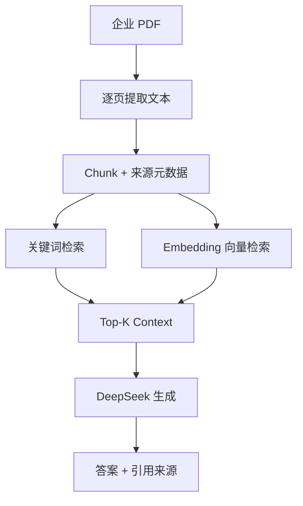

# Enterprise Insight Agent｜企业知识检索与经营分析智能体

一个面向企业公开资料的、可解释的 RAG 学习项目。当前版本已经完成最小 RAG 闭环，并加入可比较的关键词检索、Embedding 向量检索与离线评测。

> 项目策略：先建立能运行、能测试、能解释的 baseline，再逐步升级 Embedding、BM25、Hybrid Retrieval、Reranker 和经营分析 Agent。

## 当前能力（v0.2）

- 读取一个或多个文本型 PDF，并保留文件名和页码；
- 按页进行带重叠的字符切块，生成唯一 `chunk_id`；
- 使用轻量 TF-IDF + 查询词覆盖率进行中英文关键词检索；
- 使用本地多语言 Embedding 和余弦相似度进行语义检索；
- 在相同问题集上比较 `Recall@K` 和 MRR；
- 通过 OpenAI-compatible SDK 调用 DeepSeek；
- 要求回答仅依据检索上下文，并使用 `[1]`、`[2]` 标注依据；
- CLI 支持单次提问与连续交互，也可打印召回原文；
- `--retrieval-only` 可在不调用 API 的情况下检查召回结果；
- 内置零下载示例 PDF、带答案页的评测集和单元测试。

当前限制：不支持扫描件 OCR、表格结构恢复和持久化向量索引；每次启动向量模式时会重新计算当前文档的 Embedding。

## 架构



| 模块 | 文件 | 职责 |
|---|---|---|
| Ingestion | `app/ingestion.py` | PDF 读取、文本清洗、页码保留 |
| Chunking | `app/chunking.py` | 页内切块、重叠窗口、chunk id |
| Retrieval | `app/retrieval.py` | 中英文分词与可解释的关键词排序 |
| Vector Retrieval | `app/vector_retrieval.py` | 本地 Embedding、向量归一化与余弦相似度 |
| Evaluation | `app/evaluation.py` | 标注问题集、Recall@K、MRR 与逐题结果 |
| LLM | `app/llm.py` | Context 拼装、DeepSeek 调用、回答约束 |
| Pipeline | `app/pipeline.py` | 串联各模块，支持一次加载、多次提问 |
| CLI | `main.py` | 参数解析、交互提问、引用展示 |

## Windows 安装

项目已在 Python 3.13 设计环境下开发。PowerShell 中执行：

```powershell
git clone https://github.com/Mistriptide/enterprise-insight-agent.git
cd enterprise-insight-agent

py -3.13 -m venv .venv
.\.venv\Scripts\Activate.ps1
python -m pip install --upgrade pip
pip install -r requirements-dev.txt
```

如果 PowerShell 阻止激活脚本，可仅对当前终端执行：

```powershell
Set-ExecutionPolicy -Scope Process -ExecutionPolicy Bypass
.\.venv\Scripts\Activate.ps1
```

## 配置 DeepSeek

复制示例配置：

```powershell
Copy-Item .env.example .env
```

然后只在本地 `.env` 中填写：

```dotenv
DEEPSEEK_API_KEY=你的真实Key
DEEPSEEK_MODEL=deepseek-flash
```

`.env` 已被 `.gitignore` 排除。不要把真实 Key 写进代码、README、截图或提交记录。

## 两种检索方式

### 关键词 baseline

```powershell
python main.py --pdf data/sample_company_report.pdf --question "What are the main operating risks?" --retriever keyword --show-context
```

它速度快、可解释，但依赖查询和原文存在相同词语。

### Embedding 向量检索

```powershell
python main.py --pdf data/sample_company_report.pdf --question "What concerns did executives highlight?" --retriever vector --show-context
```

默认模型为 `sentence-transformers/paraphrase-multilingual-MiniLM-L12-v2`，支持中英文。FastEmbed 使用 ONNX Runtime 在 CPU 上运行，不需要 GPU。首次使用会下载约 220MB 的模型主体，实际缓存空间可能略大，并保存到当前项目的 `data/model_cache/`；该目录不会提交 GitHub。

如果只想检查检索、不调用 DeepSeek：

```powershell
python main.py --pdf data/sample_company_report.pdf --question "What concerns did executives highlight?" --retriever vector --retrieval-only --show-context
```

## 5 分钟示例流程

1. 生成一个包含两页经营信息的示例 PDF：

```powershell
python scripts/create_sample_pdf.py
```

2. 运行一次完整问答：

```powershell
python main.py --pdf data/sample_company_report.pdf --question "What are the main operating risks?" --show-context
```

3. 或进入连续提问模式：

```powershell
python main.py --pdf data/sample_company_report.pdf --show-context
```

示例问题：

- `What was the 2025 revenue?`
- `What are the main operating risks?`
- `What is the company's 2026 priority?`

CLI 会显示模型回答，以及类似下面的可追溯来源：

```text
[1] sample_company_report.pdf · 第 2 页 · sample_company_report-p2-c1
```

使用自己的资料时，可以重复传入 `--pdf`：

```powershell
python main.py --pdf data/annual_report.pdf --pdf data/esg_report.pdf -q "公司的主要增长来源是什么？"
```

注意：当前版本只支持含文本层的 PDF。若 PDF 是扫描图片，程序会提示需要 OCR。

## 测试

```powershell
python -m pytest
```

测试不调用 DeepSeek、不会消耗 API 额度，覆盖：示例 PDF 提取、页码元数据、Chunk 重叠、参数校验、中英文关键词检索、向量排序、评测指标和 Context 引用格式。

## 可比较的检索评测

先生成示例 PDF，然后在相同问题集上运行两种检索器：

```powershell
python scripts/create_sample_pdf.py
python -m scripts.evaluate_retrievers `
  --pdf data/sample_company_report.pdf `
  --dataset eval/sample_questions.json `
  --mode all `
  --cutoffs 1 3 `
  --output eval/results/retrieval_evaluation.json
```

评测集中的每道题都标注了正确文件和页码：

- `Recall@K`：正确页面是否出现在前 K 个结果中；
- `MRR`：正确页面出现得越靠前，分数越高；
- 逐题 `rank` / `MISS`：用于定位检索器具体漏掉了什么问题。

### 当前真实结果

| Retriever | Recall@1 | Recall@3 | MRR |
|---|---:|---:|---:|
| Keyword baseline | 66.7% | 83.3% | 0.750 |
| Vector retrieval | 83.3% | 100.0% | 0.917 |

逐题比较：

- Vector 改善：`management_concerns`（MISS → 1）、`next_priority`（2 → 1）；
- Vector 退化：`premium_mix`（1 → 2）；
- 排名不变：`revenue`、`sales_route`、`inventory_efficiency`。

主要结论：Embedding 能处理 `concerns / executives` 与 `risks / management` 这类没有直接词面重合的表达，也能识别 `focus on next year` 与 `2026 priority` 的语义关系。但它并非总是更好：`premium_mix` 中，当前模型没有稳定对齐 `product tier / sales` 与 `premium products / revenue`，而整页级 Chunk 混合了多项事实，进一步放大了语义偏差。

结果文件：

- `eval/results/retrieval_evaluation.json`：完整参数、分数、召回顺序和逐题排名；
- `eval/results/retrieval_evaluation.md`：指标、胜负和退化归因摘要。

实验限制：固定集只有 6 道英文问题和 2 个候选 Chunk，因此 Recall@3 接近全语料检查，区分度有限；这组结果能验证评测流程和当前方法差异，但不能代表真实中文年报上的最终效果。

## RAG 闭环如何工作

1. `pypdf` 逐页提取文字，文件名与一基页码进入元数据。
2. 每页独立切成约 700 字符的 Chunk，相邻块重叠 100 字符，减少边界信息损失。
3. 关键词模式计算 TF-IDF 和查询覆盖率；向量模式分别编码 Query 与 Passage，再计算问题和 Chunk 的余弦相似度。
4. 评测脚本在相同问题、相同 Chunk 和相同 Top-K 下比较两种方法。
5. 只把得分最高的 Top-K Chunk 送给 DeepSeek，而不是发送整份 PDF。
6. Prompt 要求模型只依据 Context 作答；CLI 同时打印真实检索来源，方便核验。

## 项目结构

```text
enterprise-insight-agent/
├── app/
│   ├── __init__.py
│   ├── models.py
│   ├── ingestion.py
│   ├── chunking.py
│   ├── retrieval.py
│   ├── vector_retrieval.py
│   ├── evaluation.py
│   ├── llm.py
│   └── pipeline.py
├── data/
│   └── .gitkeep
├── eval/
│   ├── sample_questions.json
│   ├── analysis_notes.json
│   └── results/
│       ├── retrieval_evaluation.json
│       └── retrieval_evaluation.md
├── scripts/
│   ├── create_sample_pdf.py
│   └── evaluate_retrievers.py
├── tests/
│   ├── test_chunking.py
│   ├── test_ingestion.py
│   ├── test_llm.py
│   ├── test_retrieval.py
│   ├── test_vector_retrieval.py
│   └── test_evaluation.py
├── .env.example
├── .gitignore
├── main.py
├── pyproject.toml
├── requirements.txt
└── requirements-dev.txt
```

## 迭代路线

- **v0.1**：最小 RAG 闭环 + 关键词 baseline + 引用 + CLI + 测试；
- **v0.2（当前）**：本地 Embedding 向量检索 + 固定评测集 + Recall@K / MRR 对比；
- **v0.3**：BM25 + Vector Hybrid Retrieval，加入可复现评测集；
- **v0.4**：Reranker 与检索/生成指标；
- **v0.5**：企业经营分析 Agent、结构化报告和 Streamlit Demo。

## 面试时可以怎么介绍

“我没有一开始堆叠 LangChain 等框架，而是先实现了一个可解释的关键词 baseline，再加入本地多语言 Embedding。两种检索器共用同一批 Chunk 和带答案页的问题集，通过 Recall@K 与 MRR 比较效果。系统保留文件名、页码和 chunk id，将 Top-K 证据交给 DeepSeek，并把引用与答案一起展示，因此我可以区分检索错误和生成错误。”

## 安全说明

- 仓库只包含 `.env.example`，不包含真实密钥；
- 模型只接收被召回的文本块，生产环境仍需增加敏感信息识别、权限控制和审计；
- 生成答案可能出错，关键经营结论必须回到引用原文核验。
